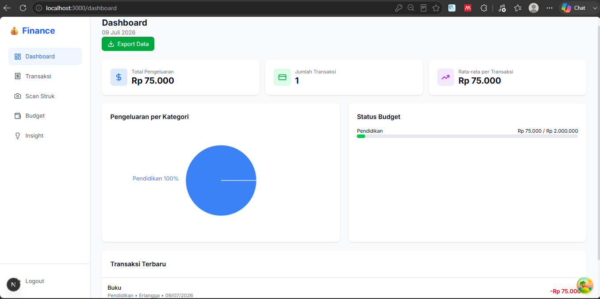

<a id="readme-top"></a>

<div align="center">


<h3 align="center">Personal Finance Tracker</h3>

<p align="center">
  Aplikasi pencatat keuangan pribadi dengan scan struk dan kategorisasi transaksi otomatis
  <br />

  <br />
  <br />
  <a href="https://github.com/AssariyRamdhani9/finance-tracker/issues/new?labels=bug">Report Bug</a>
  ·
  <a href="https://github.com/AssariyRamdhani9/finance-tracker/issues/new?labels=enhancement">Request Feature</a>
</div>

---

<details>
  <summary>Table of Contents</summary>
  <ol>
    <li><a href="#about-the-project">About The Project</a></li>
    <li><a href="#built-with">Built With</a></li>
    <li>
      <a href="#getting-started">Getting Started</a>
      <ul>
        <li><a href="#prerequisites">Prerequisites</a></li>
        <li><a href="#installation">Installation</a></li>
      </ul>
    </li>
    <li><a href="#usage">Usage</a></li>
    <li><a href="#roadmap">Roadmap</a></li>
    <li><a href="#known-issues">Known Issues</a></li>
    <li><a href="#contributing">Contributing</a></li>
    <li><a href="#license">License</a></li>
  </ol>
</details>

---

## About The Project



Proyek ini bertujuan untuk mengotomatisasi pencatatan transaksi keuangan harian untuk menggantikan metode manual yang memakan waktu. Pengembangan dimulai dari pembuatan antarmuka input dasar, yang kemudian ditingkatkan dengan integrasi Gemini AI. Melalui fitur Optical Character Recognition (OCR) dan pemrosesan bahasa alami dari Gemini, pengguna dapat memindai struk belanja untuk mencatat dan mengkategorikan pengeluaran secara otomatis, cepat, dan akurat

Fitur yang ada saat ini:

* Scan struk belanja — upload foto, AI baca dan input transaksi otomatis
* Kategorisasi transaksi otomatis berdasarkan deskripsi/merchant
* Input transaksi manual untuk kasus yang gagal ke-scan
* Dashboard dengan grafik pengeluaran per kategori
* Budget per kategori dengan indikator pemakaian
* Export transaksi ke CSV
* Autentikasi JWT, data user terisolasi lewat Row Level Security di Supabase

(<a href="#readme-top">back to top</a>)

## Built With

| Layer | Teknologi |
|---|---|
| Frontend   | Next.js 14 (App Router) |
| Frontend   | TypeScript |
| Frontend   | Tailwind CSS |
| Frontend   | React Query |
| Frontend   | Zustand |
| Frontend   | Recharts |
| Backend    | FastAPI |
| Backend    | Supabase (PostgreSQL, Auth, Storage) |
| Backend    | Gemini API (OCR & kategorisasi) |
| Deployment | Vercel (frontend) |
| Deployment | Railway (backend) |

(<a href="#readme-top">back to top</a>)

## Getting Started

Ikuti langkah berikut untuk menjalankan proyek ini di lokal.

### Prerequisites

* Node.js 18+
* Python 3.10+
* Akun Supabase (tier gratis cukup)
* API Key Gemini dari [Google AI Studio](https://aistudio.google.com/)

```bash
npm install npm@latest -g
```

### Installation

1. Clone repo

```bash
   git clone https://github.com/AssariyRamdhani9/finance-tracker.git
   cd finance-tracker
```

2. Setup backend

```bash
   cd backend
   python -m venv venv
   source venv/bin/activate  # Windows: venv\Scripts\activate
   pip install -r requirements.txt
```

3. Buat file `.env` di folder `backend/`

```env
   SUPABASE_URL=your_supabase_url
   SUPABASE_KEY=your_supabase_service_key
   GEMINI_API_KEY=your_gemini_api_key
   JWT_SECRET=your_jwt_secret
```

4. Jalankan server backend

```bash
   uvicorn main:app --reload --port 8000
```

5. Setup frontend

```bash
   cd ../frontend
   npm install
```

6. Buat file `.env.local` di folder `frontend/`

```env
   NEXT_PUBLIC_API_URL=http://localhost:8000
   NEXT_PUBLIC_SUPABASE_URL=your_supabase_url
   NEXT_PUBLIC_SUPABASE_ANON_KEY=your_supabase_anon_key
```

7. Jalankan frontend

```bash
   npm run dev
```

8. Buka `http://localhost:3000` di browser

(<a href="#readme-top">back to top</a>)

## Usage

Setelah server backend dan frontend jalan:

1. Register/login di halaman awal
2. Klik "Scan Struk" untuk upload foto struk, atau isi form manual di "Tambah Transaksi"
3. Lihat rekap pengeluaran per kategori di Dashboard
4. Atur budget bulanan per kategori di halaman Budget
5. Export data lewat tombol "Export CSV" di halaman Transaksi

(<a href="#readme-top">back to top</a>)

## Roadmap

- [ ] Support multi-currency
- [ ] Transaksi berulang (recurring transaction)
- [ ] Export ke PDF
- [ ] Dark mode
- [ ] Aplikasi mobile (belum diputuskan native atau PWA)


(<a href="#readme-top">back to top</a>)

## Known Issues

* Akurasi OCR struk masih drop kalau foto blur atau struk kusut/pudar
* Kategorisasi otomatis kadang salah untuk merchant yang jarang muncul di data training
* Belum ada rate limiting di endpoint upload struk

(<a href="#readme-top">back to top</a>)


